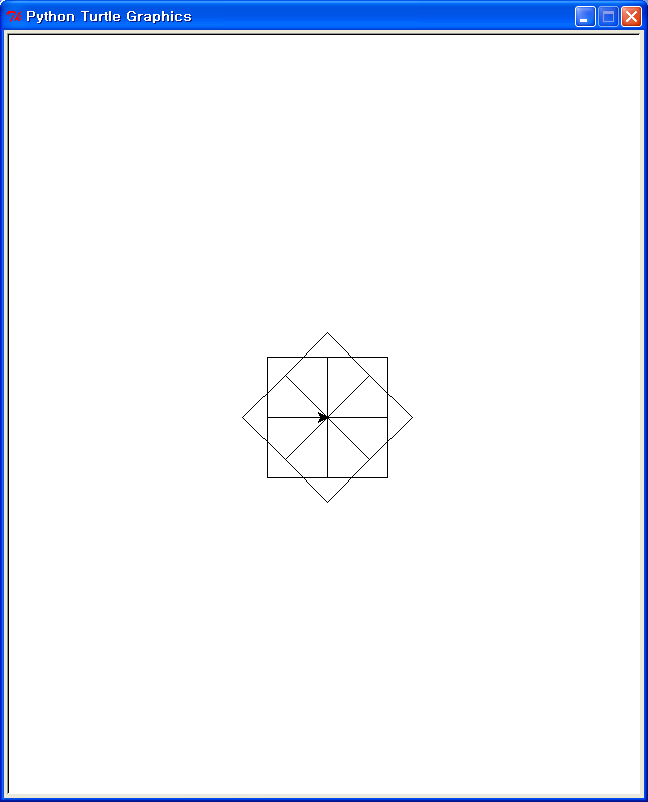
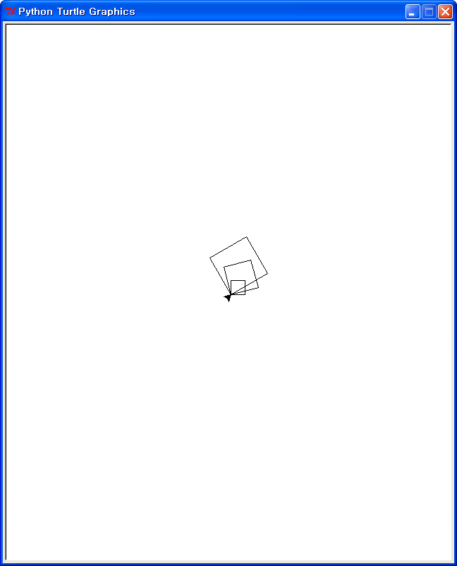
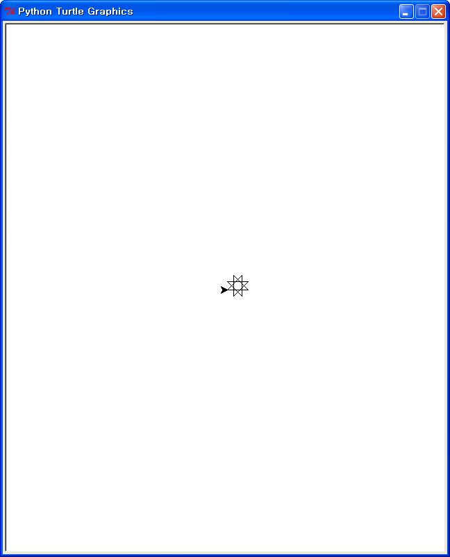
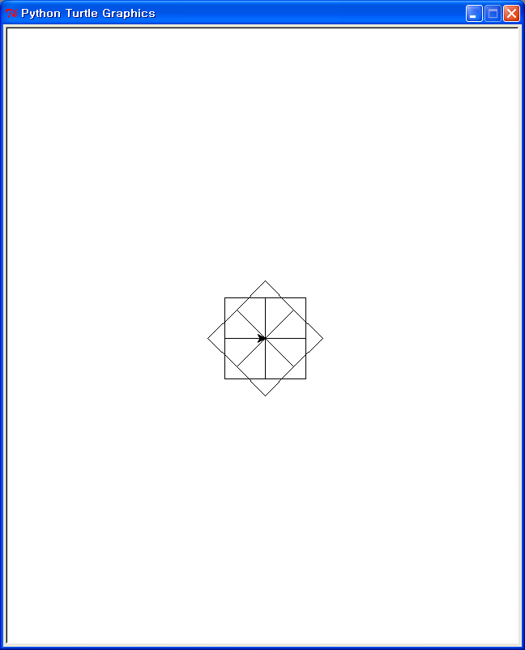
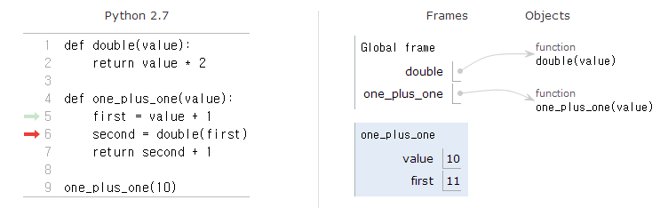

> ## Learning Objectives
>
> *   Define a function.
> *   Define a function that takes parameters.
> *   Explain what a call stack is and why programs use them.
> *   Trace the execution of nested function calls using a call stack.

If we only wanted to draw one polygon once,
the simplest thing would be to type in the three lines we finished the last lesson with:

~~~ {.input}
>>> for side in range(6):
...     turtle.forward(50)
...     turtle.left(60)
... 
~~~

But if we want to draw lots of different polygons,
we'd like to be able to type:

~~~ {.input}
>>> polygon(6, 50, 60)
~~~

and have Python figure out the rest.
Let's build up to that in stages.

First, let's create a new **function** to draw a fixed-size square:

~~~ {.input}
>>> def square():
...     for side in range(4):
...         turtle.forward(60)
...         turtle.left(90)
...
~~~

Python doesn't print anything when we do this,
and the turtle doesn't move,
because we haven't actually asked it to do anything ---
instead, we've told it how to do something new *if we ask*.
To ask,
we **call** the function
the same way we have been calling the turtle's methods:

~~~ {.input}
>>> square()
~~~

Here's what just happened:

1.  When we define a new function using `def`,
    Python takes the commands that are indented under the first line ---
    the **body** of the function ---
    and stores them in memory.

2.  When we call the function,
    Python looks up that definition
    and executes those commands.

A function that draws the same square we've been drawing all along
may not seem very useful,
but clear the screen and run this:

~~~ {.input}
>>> for petal in range(8):
...     square()
...     turtle.left(45)
...
~~~

The output is eight squares laid out on top of each other:

We could draw this in other ways ---
in fact,
we will in [a later lesson](FIXME) ---
but we can already see that putting commands in functions
makes other code easier to read.
It also allows us to re-use things:
we can now draw squares whenever we want
without having to re-enter the same lines over and over.

Of course,
this would be more useful if we could change the size of the square.
Let's re-define the function to allow that:

~~~ {.input}
def square(length):
...     for side in range(4):
...         turtle.forward(length)
...         turtle.left(90)
...
~~~

When we enter this definition,
it takes the place of the previous one:

In it,
the function `square` has a **parameter** called `length`.
Just as the variable `side` keeps track of where we are in the loop,
`length` stores the value passed into `square` when we call it.
For example,
if we write:

~~~ {.input}
>>> square(20)
~~~

then `length` has the value 20,
while if we write:

~~~ {.input}
>>> square(30)
~~~

then `length` has the value 30.
When we move the turtle,
we don't tell it to go forward a fixed amount.
Instead,
we write `turtle.forward(length)` to tell it to move `length` pixels.
The function call `square(30)` therefore tells the turtle to draw a square 30 pixels on a side,
while `square(90)` tells it to draw one three times larger.
This lets us draw images like this:

~~~ {.input}
>>> for size in [20, 40, 60]:
...     square(size)
...     turtle.left(15)
...
~~~

Notice,
by the way,
that we are now using the values in our loop for something real.
The lists of numbers in our previous loops didn't matter ---
their only purpose was to make the loop run the right number of times.
Here,
though,
the three numbers 20, 40, and 60 are being passed into `square`
to tell it how large a shape we want.

If one parameter is good,
what about two or three?

~~~ {.input}
>>> def polygon(sides, length, angle):
...     for s in range(sides):
...         turtle.forward(length)
...         turtle.left(angle)
...
~~~

Once again,
nothing happens until we actually call the function:

~~~ {.input}
>>> polygon(6, 30, 60)
~~~

but then the turtle draws this:

and if we call this:

~~~ {.input}
>>> polygon(8, 30, 135)
~~~

we get:

> ## Variable Names {.callout}
>
> FIXME: explain meaningful names and the use of `s` in the function.

Once we have a function,
there's no reason not to use it in another one.
Here's a function that creates a "flower" like the one we drew earlier:

~~~ {.input}
>>> def flower(petal_sides, petal_angle, poly_sides, poly_length, poly_angle):
...     for s in range(petal_sides):
...         polygon(poly_sides, poly_length, poly_angle)
...         turtle.left(petal_angle)
...
~~~

`flower` takes five parameters.
The first two control the drawing of the whole flower,
while the other three control the shape of each petal:

We can use this to draw the eight-squares flower we did earlier:

~~~ {.input}
>>> flower(8, 45, 4, 50, 90)
~~~

which means,
"Draw eight squares,
each 50 pixels in size,
turning 45 degrees between each one."

We can also use it to draw shapes like this:

~~~ {.input
>>> flower(3, 120, 3, 50, 120)
~~~

Put the two functions side by side for a moment
and look at their loops:

FIXME: can we do side-by-side code with Markdown and Pandoc?

~~~ {.python}
def polygon(sides, length, angle):
    for s in range(sides):
        turtle.forward(length)
        turtle.left(angle)

def flower(petal_sides, petal_angle, poly_sides, poly_length, poly_angle):
    for s in range(petal_sides):
        polygon(poly_sides, poly_length, poly_angle)
        turtle.left(petal_angle)
~~~

They both use a variable called `s` as a loop variable,
but these are different variables ---
they just happen to have the same name.
To see how this works,
let's define a simpler function:

~~~ {.python}
>>> def double(value):
...     return value * 2
...
~~~

The `return` command tells the function what value to return to its caller:

~~~ {.input}
>>> print double(3)
~~~
~~~ {.output}
4
~~~

Here's another simple function that uses `double`:

~~~ {.input}
>>> def one_plus_one(value):
...     first = value + 1
...     second = double(first)
...     return second + 1
...
~~~

and here's what happens when we call `one_plus_one(10)`:

1.  Python puts the value 10 on a **call stack**,
    which gets its name from the fact that values being passed to function calls
    are stacked on top of one another.

2.  Python then creates a new variable `first` in the **stack frame**
    it is using to keep track of what's happening inside `one_plus_one`
    and gives `first` the value 11 (which is 10 + 1).

3.  `one_plus_one` now calls `double`,
    so Python creates another stack frame and passes in the value 11.

    Notice that there are now two variables called `value`,
    but since they are in different stack frames,
    they are actually different variables ---
    they just happen to have the same name.

4.  `double` returns 22 (which is 11 * 2),
    so Python discards the stack frame it was using to keep track of that call
    and starts using the one underneath it again.
    There,
    it puts the value 22 in a newly-created variable called `second`:

5.  The function `one_plus_one` finally returns 23 (which is 22 + 1),
    so Python throws away that function call's stack frame
    and prints the final result.

See more on [call stack from pythontutor.com](http://goo.gl/nPfnnt)

This probably seems like a lot of trouble to go through,
but it's absolutely essential.
Imagine what it would be like if all of the variables in a program
were stored in one place.
Whenever we wrote a new function,
we would have to be careful not to use any name that anyone else was using
in order to avoid accidentally referring to the wrong variable.
In order to do that,
we would have to read every single line of every function we called.
Even if we were patient enough to do that,
our program could break as soon as the authors of any of those functions
rewrote their code and changed variables' names.

The key idea here is **encapsulation**.
and it's the key to writing correct, comprehensible programs.
A function's job is to turn several operations into one
so that we can think about a single function call
instead of a dozen or a hundred statements
each time we want to do something.
That only works if functions don't interfere with each other;
if they do,
we have to pay attention to the details once again,
which quickly overloads our short-term memory.
