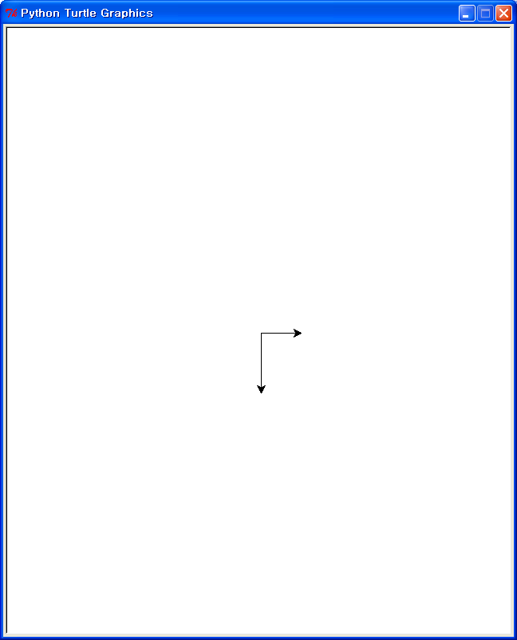
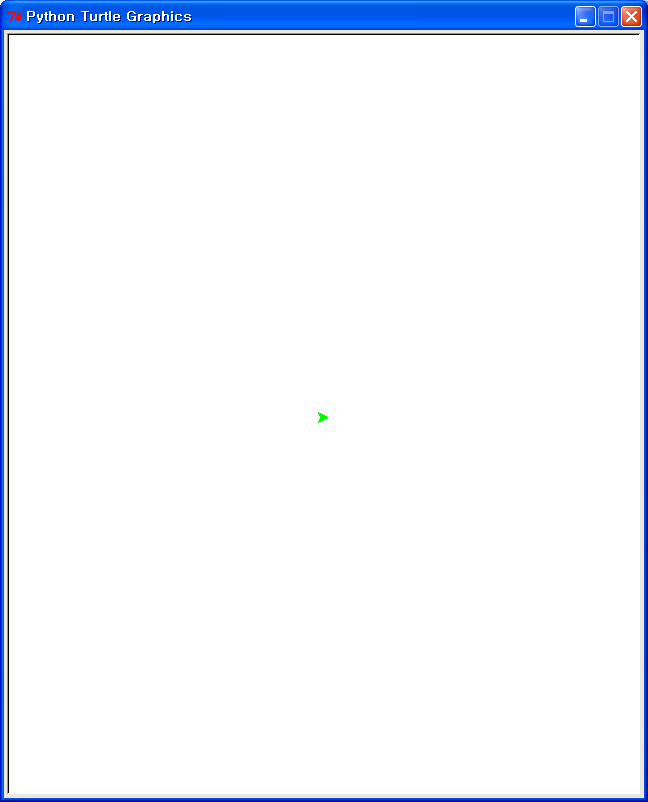
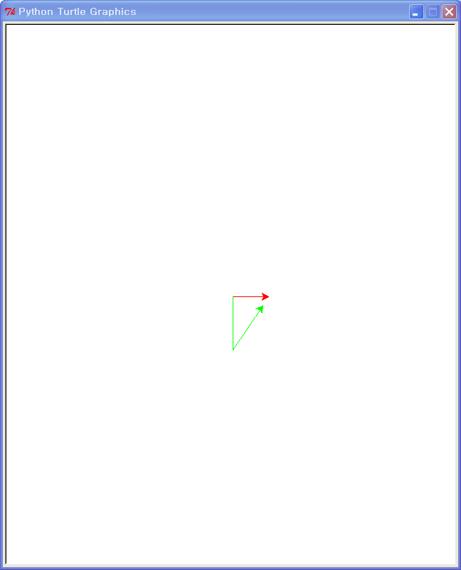

> ## Learning Objectives
>
> *   Create and control multiple turtles.
> *   Use instance variables to record state.

We don't have to use just one turtle for drawing:
the `turtle` library will let us create as many as we want.
To start,
let's import a **class** called `Turtle`
(with an upper-case 'T')
from the `turtle` library:

~~~ {.input}
>>> from turtle import Turtle
~~~

We can now create a new turtle called `slowpoke` like this:

~~~ {.input}
>>> slowpoke = Turtle()
~~~

and then move it like this:

~~~ {.input}
>>> slowpoke.forward(50)
~~~

We can now create a second turtle and move it south:

~~~ {.input}
>>> speedy = Turtle()
>>> speedy.right(90)
>>> speedy.forward(75)
~~~

It can be hard to keep track of which turtle is which,
so let's put them back in the starting position and change their colors:

~~~ {.input}
>>> slowpoke.reset()
>>> speedy.reset()
>>> slowpoke.color('red')
>>> speedy.color('green')
~~~

We can only see `speedy` (the green turtle)
because it's on top of `slowpoke`.
Let's move them again:

~~~ {.input}
>>> slowpoke.forward(50)
>>> speedy.right(90)
>>> speedy.forward(75)
~~~

Now try this:

~~~ {.input}
>>> print slowpoke.position()
~~~
~~~ {.output}
(50.00,0.00)
~~~ {.input}
>>> print speedy.position()
~~~
~~~ {.output}
(0.00,-75.00)
~~~

The pair `(50.00,0.00)` is called a **tuple**.
Python uses tuples to store values that have parts,
like these (x,y) coordinate pairs.

Given `speedy` and `slowpoke`'s positions,
we could do a bit of trigonometry
to figure out how to turn `speedy`
to point toward `slowpoke`.
This is such a common operation that the `turtle` library
provides a way to do it:

~~~ {.input}
>>> slowpoke_coords = slowpoke.position()
>>> print speedy.towards(slowpoke_coords)
~~~
~~~ {.output}
56.309932474
~~~

This is not actually the amount `speedy` needs to turn
to point toward `slowpoke`,
but rather the absolute heading `speedy` needs to be on.
Luckily
(which means "because a programmer wrote the code")
turtles have a method for that as well.
Let's turn `speedy` and then move it forward a bit
so we can see that it's on the right path:

~~~ {.input}
>>> new_heading = speedy.towards(slowpoke_coords)
>>> speedy.setheading(new_heading)
>>> speedy.forward(75)
~~~

We now have a way to make one turtle chase another.
The slow turtle --- the prey in this scenario ---
will move along a fixed path.
Each time the fast turtle --- the predator --- moves,
it points toward the slow turtle and takes a step.
We'll use small steps (a few pixels at a time)
to make the simulation look more realistic.
We will also use `turtle.penup` and `turtle.pendown`
to turn drawing off and on
so that we can move turtles to their starting positions
without leaving lines on the screen,
and `turtle.setposition` to move a turtle to an absolute location.

Here's the start of our program:

~~~ {.input}
>>> # Get slowpoke into position
>>> slowpoke.reset()
>>> slowpoke.color('red')
>>> slowpoke.penup()
>>> slowpoke.setposition((60, 0))
>>> slowpoke.pendown()

>>> # Get speedy into position
>>> speedy.reset()
>>> speedy.color('green')
>>> speedy.penup()
>>> speedy.setposition((0, -75))
>>> speedy.pendown()
~~~

We should stop as soon as we get this far
and think a little more carefully about what we're doing.
The first five lines are the same as the second except for:

*   which turtle we're moving,
*   what color we make it, and
*   where it goes.

We should therefore write (or have written) a function to do all of this,
since we're probably going to do it several times.
Here's the function:

~~~ {.input}
>>> def setup(this_turtle, color, position):
...     this_turtle.reset()
...     this_turtle.color(color)
...     this_turtle.penup()
...     this_turtle.setposition(position)
...     this_turtle.pendown()
~~~

We can now put our turtles in position like this:

~~~ {.input}
>>> setup(slowpoke, 'red', (60, 0))
>>> setup(speedy, 'green', (0, -75))
~~~

This is *almost* what we had before ---
the only difference is that `speedy` is now pointing right rather than down,
because we set its position
rather than turning it and moving it into position.
After a moment's thought,
we decide that we don't care,
so we leave the function as it is.

Now let's write the code that moves the turtles:

~~~ {.input}
for step in range(50):
    slowpoke.forward(3)
    slowpoke_coords = slowpoke.position()
    new_heading = speedy.towards(slowpoke_coords)
    speedy.setheading(new_heading)
    speedy.forward(5)
~~~

This is the curve we want,
but if we watch the simulation run
(i.e., watch the turtles as they draw)
we can see that `speedy` sometimes gets ahead of `slowpoke`,
turns around,
comes back,
then turns around again to resume the chase.
We can worry about that later;
right now,
what we should think about is whether there's a better way
to write our loop.
Let's take a closer look at `turtle.towards`:

~~~ {.input}
>>> help(turtle.towards)
~~~
~~~ {.output}
towards(x, y=None)
    Return the angle of the line from the turtle's position to (x, y).
    
    Arguments:
    x -- a number   or  a pair/vector of numbers   or   a turtle instance
    y -- a number       None                            None
    
    call: towards(x, y)         # two coordinates
    --or: towards((x, y))       # a pair (tuple) of coordinates
    --or: towards(vec)          # e.g. as returned by pos()
    --or: towards(mypen)        # where mypen is another turtle
    
    Return the angle, between the line from turtle-position to position
    specified by x, y and the turtle's start orientation. (Depends on
    modes - "standard" or "logo")
    
    Example:
    >>> pos()
    (10.00, 10.00)
    >>> towards(0,0)
    225.0
~~~

That doesn't all make sense yet ---
for example, we won't encounter `None` until the next lesson ---
but this line looks interesting:

~~~ {.output}
    --or: towards(mypen)        # where mypen is another turtle
~~~

Sure enough,
we don't have to get `slowpoke`'s coordinates
and then ask `speedy` how to point toward that location:
we can just ask `speedy` to point toward `slowpoke`.
Let's put our turtles back in their starting positions:

~~~ {.input}
>>> setup(slowpoke, 'red', (60, 0))
>>> setup(speedy, 'green', (0, -75))
~~~

(That was easier than typing in all the commands again, wasn't it?)
Now let's ask `speedy` how much it should turn:

~~~ {.input}
>>> print speedy.towards(slowpoke)
~~~
~~~ {.output}
51.3401917459
~~~

The other thing we should fix is the **magic numbers** in our code.
When we come back to this code tomorrow, next week, or six months from now,
it may take us a moment to figure out what the 50, 3, and 5 are for.
Let's give those values names:

~~~ {.input}
>>> STEPS = 50
>>> SLOW = 3
>>> FAST = 5

>>> for step in range(STEPS):
...     slowpoke.forward(SLOW)
...     new_heading = speedy.towards(slowpoke)
...     speedy.setheading(new_heading)
...     speedy.forward(FAST)
~~~

This is three lines longer than our original program,
but much easier to understand.
All the parameters controlling our simulation are clearly named and in one place,
so that if we want to experiment with different step sizes (i.e., speeds)
and different simulation lengths,
we can immediately see what to change.
We can take this further and put the main simulation loop in a function as well:

~~~ {.input}
>>> def run():
...     for step in range(STEPS):
...         slowpoke.forward(SLOW)
...         new_heading = speedy.towards(slowpoke)
...         speedy.setheading(new_heading)
...         speedy.forward(FAST)
~~~

To run a simulation,
all we now have to do is:

~~~ {.input}
>>> setup(slowpoke, 'red', (60, 0))
>>> setup(speedy, 'green', (0, -75))
>>> run()
~~~
